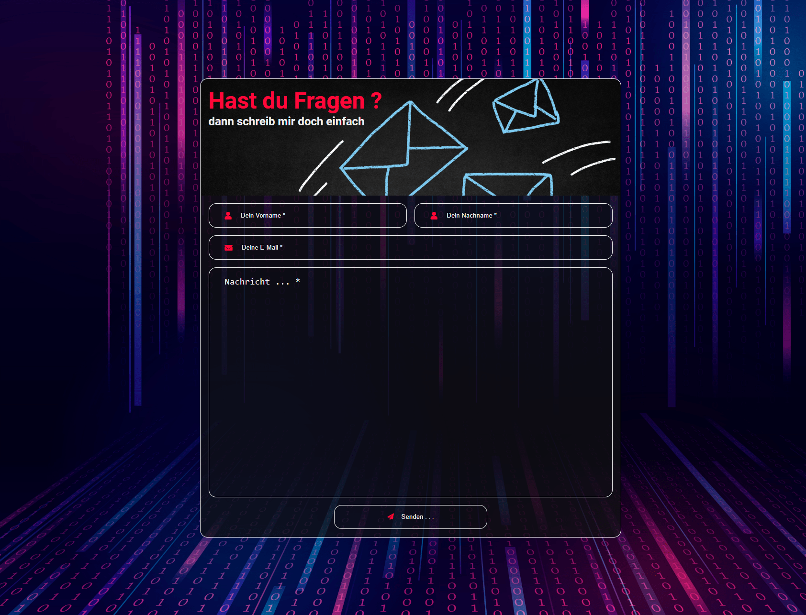

# Struckys Kontaktformular
**Das ist ein schönes von mir erstelltes Kontaktformular** 

[](https://strucky1988.github.io/struckys-kontaktformular/)

## Get Started

- **Entwicklungsumgebung:** <a href="https://code.visualstudio.com/">Visual Studio Code</a>  
- **Erweiterungen:** <a href="https://marketplace.visualstudio.com/items?itemName=glenn2223.live-sass">Live Sass Compiler</a>
- **in settings.json einfügen:**
``` bash
"liveSassCompile.settings.formats": [
    {
      "format": "compressed",
      "extensionName": ".min.css",
      "savePath": "~/../css",
    },
  ],
  "liveSassCompile.settings.generateMap": true,
```
## License

[MIT](LICENSE)

## Quellen von Bildern

- <a href='https://de.freepik.com/vektoren/textur'>Textur Vektor erstellt von rawpixel.com - de.freepik.com</a>
- <a href='https://de.freepik.com/fotos/geschaeft'>Geschäft Foto erstellt von dashu83 - de.freepik.com</a>

